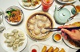

# Food-Menu

Created a menu card for Crazzy Momo from scartch. This menu card has some hover visuals and vibrant colours with makes the menu card more appealing to watch.
Web Technologies used are HTML5 and CSS3.

# License

[The MIT License (MIT)](LICENSE)
